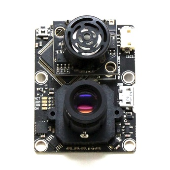

[3DR Iris+](https://3dr.com/support/iris/) is an inexpensive and easy to modify platform that can be used to build a drone with autonomous navigation capabilities.

1. [Hardware customization](#hardware-customization)
    1. [Jetson board](#jetson-board)
    2. [PX4FLOW optical flow module](#px4flow)
    3. [LIDAR Lite v3](#lidar-lite-v3)
2. [Initial setup and test](#initial-setup-and-test)
    1. [Firmware](#firmware)
    2. [Calibration and controls](#calibration-and-controls)
    3. [Pixhawk parameters](#pixhawk-parameters)

# Hardware customization
## Jetson board
The project uses Jetson TX2 (or TX1) module attached to an [Auvidea J-120 carrier board](https://auvidea.com/j120/). Other Jetson carrier boards should work too; please consult the [NVIDIA website](https://developer.nvidia.com/embedded/community/ecosystem) for additional information. We designed a special frame mount to attach the Auvidea J-120 carrier board and accompanying Jetson to the bottom of the Iris+ drone. This mount can be 3D printed on almost any consumer-grade 3D printer. We recommend "strong and flexible plastic" filament (can be ordered at [Shapeways website](https://shapeways.com)). The STL file is available at `tools/platforms/iris/iris_tgr_mount3.stl`
A 3D printed mount should look like this:


### Jetson to Pixhawk wiring
The Pixhawk and Jetson carrier boards are connected using a cable that plugs into `TELEM2` port on Pixhawk and `UART0/2` on J-120 carrier board. Connectors:
* The Pixhawk uses [6-pin Hirose DF13 connector](https://www.digikey.com/product-detail/en/hirose-electric-co-ltd/DF13-6S-1.25C/H2183-ND/241753) for its `TELEM2` port. 
* The J-120 uses a 6-pin Molex PicoBlade connector; use the parts that come with the J-120 or order from [DigiKey](https://www.digikey.com/product-detail/en/molex-llc/51021-0600/WM1724-ND/242846). 

Use the pre-crimped wires that come with J-120 or order from [DigiKey](https://www.digikey.com/products/en?keywords=H4BBT-10108) to make the following connections:
* ground pin on `TELEM2` to ground pin on `UART`
* **T**X pin on `TELEM2` to **R**X pin `UART` 
* **R**X pin on `TELEM2` to **T**X pin on `UART`.

**Important**: on the J-120 rev.4 and later, `UART2` RX/TX pins are 4 and 5, next to the `GND` pin. Pins 2 and 3 are `UART0` which is a console - do NOT connect Pixhawk to `UART0`! Refer to the J-120 and Pixhawk documentation to make sure you understand the wiring. 

This is the properly connected Pixhawk and J-120:


**Note**: if you wish to connect Jetson DevKit board and Pixhawk follow [these instructions](../wiki/Dev-board-UART-and-Pixhawk-connection).

### Jetson power wiring
The Iris+ drone has a [JST RCY](http://www.jst-mfg.com/product/pdf/eng/eRCY.pdf) connector which outputs 12V which is used to power the Jetson board. Use JST RCY on one end and the 4-pin Molex PicoBlade on another end. Here is an example of such wiring (note the wires' polarity):


## PX4FLOW
The drone should be able to fly in GPS-denied environments such as forests, tunnels, and inside of buildings. You can either use a visual SLAM system or external optical tracker for estimating drone's pose (see [PX4 tutorial](https://dev.px4.io/en/ros/external_position_estimation.html)) or you can use a
[PX4FLOW](https://pixhawk.org/modules/px4flow) optical flow based sensor. 



The PX4FLOW sensor computes 2D optical flow, estimates distance to the ground, and fuses this data with IMU measurements to estimate the drone's velocity. The computed velocity is then fused in Pixhawk's Extended Kalman Filter to estimate the drone's position and orientation (see [PX4FLOW tutorial](https://dev.px4.io/en/tutorials/optical_flow.html)). PX4FLOW measurements can also be fused with GPS position data to help with GPS stabilized flight. We currently use PX4FLOW with the LPE pose estimator in a PX4 1.4.4 stack. 
The PX4FLOW is mounted on the bottom of the 3D-printed frame mount with its `Y` axis pointing in the direction of drone's `X` axis (its sonar should be facing the front of the drone). For best accuracy, the PX4FLOW sensor should be mounted as close as possible to the drone's center of gravity. The sensor is connected via an I2C cable to the Iris+ switch board that connects to Pixhawk I2C port.

**NOTE**: PX4FLOW sonar will not work at temperatures below 0C (32F) therefore we recommend using separate LIDAR Lite (or similar) for distance to the ground measurements.

### PX4FLOW Firmware  
Our project uses custom PX4FLOW firmware which provides better stability in low light environments like forests. This firmware also has a better (and faster) re-initialization in case of lost tracking. The firmware can be downloaded from its GitHub project at ["PX4FLOW exposure for indoors"](https://github.com/PX4/Flow/pull/86). We also replaced stock 16 mm PX4FLOW lens with a wider angle 6 mm lens with an IR filter. If you do this, you need to change a default focal length in the PX4FLOW firmware code and re-build it before PX4FLOW flashing. The PX4FLOW camera focal length is set in `px4flow/src/modules/flow/settings.c` file as:
```
global_data.param[PARAM_FOCAL_LENGTH_MM] = 16.0f;
```
it needs to be changed from 16.0f to whatever focal length (in mm) you have, i.e. 6.0f for 6 mm lens.
Increasing the field of view makes the sensor more stable when tracking the drone's pose over surfaces with less texture (concrete, office carpet, asphalt, etc.). Using an IR filter helps with ignoring the Lidar Lite spotlight if you use one for height measurements.

### Hardware setup
The Pixhawk and PX4FLOW wiring is described in the [PX4](https://dev.px4.io/en/tutorials/optical_flow.html) documentation. Here is the example setup of PX4FLOW together with LIDAR Lite (described in the next section):


### Optical sensor image focusing and testing
Make sure that optical flow sensor camera is focused properly. We recommend using 6mm lens for better quality.
1. Connect the PX4FLOW sensor over micro USB to your PC
2. Open QGroundControl
3. Go to parameters and find the parameter `VIDEO_ONLY`. Set it to 1 and save.
4. At this point QGroundControl should show a video stream from the sensor. You can use it to focus the PX4FLOW camera.
5. Focus the camera (by rotating the focusing ring) at the expected working range (typically a distance of 1m). The image should not be blurry at that distance.
6. Fix the ring after focusing (either with a screw or a turn ring).
7. Set the parameter `VIDEO_ONLY` back to 0 and save.

At this point you can open Plots in QGroundControl and plot any event that starts with `FLOW_`. You can see if it estimates reasonable `XY` optical flow and `Z` distance to the floor.

## Lidar Lite v3
Our project uses the inexpensive and easy-to-use [LIDAR Lite v3](https://buy.garmin.com/en-US/US/p/557294) sensor for altitude measurement. The PX4FLOW sensor module incorporates a sonar transceiver, but it's not very accurate and has several issues such as not working in low temperatures (<32F/0C). Most of the setup steps are already described in the [Pixhawk](https://pixhawk.org/peripherals/rangefinder) and [PX4](https://dev.px4.io/en/tutorials/optical_flow.html) guides. LIDAR Lite v3 supports both I2C and PWM modes; refer to [the official documentation](http://garmin.com/manuals/lidar) for more details. We use LIDAR Lite in PWM mode as we were not able to make it work in I2C mode. Using PWM mode requires proper wiring and some very basic soldering as described in the Pixhawk guide. We use slightly modified wiring to power the Pixhawk servo (`AUX OUT`) rail from the I2C switch because, by default, [the servo rail is not powered](http://ardupilot.org/copter/docs/common-powering-the-pixhawk.html#common-powering-the-pixhawk-pixhawk-poweresc-wiring-overview). Here is the example of the wiring:

Wires:


The LIDAR Lite comes with a [6-pin JST GH](https://www.digikey.com/product-detail/en/jst-sales-america-inc/GHR-06V-S/455-1596-ND/807818) connector. The Green and blue wires are used only in I2C mode so they can be safely detached from the connector. Note that the Lidar Lite v3 comes with a connector that has 6 different colored wires, so it will look different from what is shown on the Pixhawk LIDAR setup page. Check the LIDAR Lite [documentation](http://garmin.com/manuals/lidar) for the wiring. Red(`+5V`), black(`GND`) and orange(`power enable`) must be connected to one [3-pin Futaba servo connector](https://www.servocity.com/servo-connector-types) (Hitec will work too), while the yellow wire must be connected to another servo connector (with pull-up resistor as shown in the Pixhawk documentation). The first servo connector must be connected to AUX OUT port 6 while the second should be connected to port 5. This is important as the LIDAR Lite won't work if connected to other ports. Use a [DF-13](https://www.digikey.com/product-detail/en/hirose-electric-co-ltd/DF13-4S-1.25C/H2181-ND/241750) connector to connect to the I2C switch board to provide power to the servo rail.

Iris+ Pixhawk connections:


# Initial setup and test
## Firmware
Our project uses [PX4 firmware v1.4.4](https://github.com/PX4/Firmware/releases/tag/v1.4.4). While other versions might work, we have not tested them and strongly recommend using the version that we have tried and proven to be working. To flash the firmware, download [Firmware.zip](https://github.com/PX4/Firmware/releases/download/v1.4.4/Firmware.zip) and unpack it. Next, connect the Pixhawk to your computer, run QGroundControl GCS, and flash the firmware with the `nuttx-px4fmu-v2-default.px4` file. Here is how QGroundControl should appear:


## Calibration and controls
Follow the standard steps to calibrate the sensors, RC, and flight modes for the drone. While setting up the flight modes, assign two switches: one as as a "kill" switch, and one as a "offboard" switch. The kill switch is an important safety mechanism which allows the pilot to disconnect power from the motors at any time (usually in case of emergency). The offboard switch allows the pilot to explicitly control when the Pixhawk is controlled by an external source (in our case, the controller code running on the Jetson). The setup may look like this:


## Pixhawk parameters
There are several Pixhawk/PX4 parameters that need to be changed in order for all systems to work properly. These parameters can be set via QGroundControl (`Setup -> Parameters` tab) or loaded from the settings file located at `tools/platforms/iris/px4settings.params`. Note that this file contains only some of the redtail-related settings as some of the settings require Pixhawk to be rebooted to proceed to the next step.

**Important**: to enable flights without GPS, disable GPS support by setting `LPE_GPS_ON` parameter to 0 and restart the Pixhawk.

### General
| Page   | Parameter          | Value                                          |
| -------| ------------------ | ---------------------------------------------- |
| System | `SYS_MC_EST_GROUP` | local_position_estimator, attitude_estimator_q |

Reboot after changing `SYS_MC_EST_GROUP` parameter before following the next steps.

### Jetson connectivity
Change the following parameters to enable link between Jetson(MAVROS) and Pixhawk:

| Page   | Parameter       | Value                            |
| ------ | --------------- | -------------------------------- |
| System | `SYS_COMPANION` | Companion Link(921600 baud, 8N1) |

### PX4FLOW
| Page                         | Parameter         | Value             |
| ---------------------------- | ----------------- | ------------------|
| Local Position Estimator     | `LPE_LAT`         | 0                 |
| Local Position Estimator     | `LPE_LON`         | 0                 |
| Local Position Estimator     | `LPE_T_MAX_GRADE` | 1%                |
| Mission                      | `MIS_TAKEOFF_ALT` | 1.5               |
| Multicopter Position Control | `MPC_ALT_MODE`    | Terrain following |
| Multicopter Position Control | `MPC_XY_P`        | 0.5               |
| Multicopter Position Control | `MPC_XY_VEL_MAX`  | 2                 |

### Lidar Lite v3
| Page          | Parameter      | Value   |
| --------------| -------------- | ------- |
| Sensor Enable | `SENS_EN_LL40LS` | Enabled |
