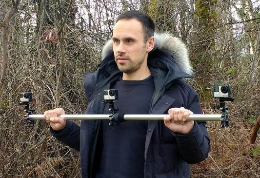
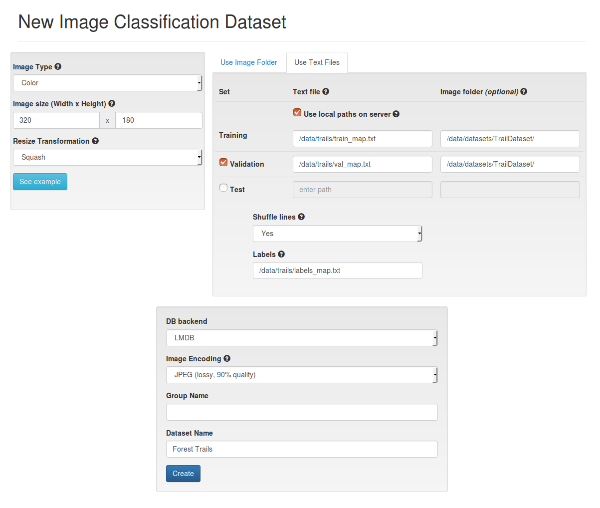

# Dataset preparation
This directory contains our camera rig calibration application and scripts that are used to create datasets:

`redtail/tools`

To collect data and autolabel it, we used a simple 3 camera rig with GoPro Hero 4/5 cameras:


The cameras are mounted on a pole (ours was 1m in length) with one camera clamped securely on the left side, one clamped in the middle, and one on the right side. The video recording rig is then walked (or driven slowly) along the middle of the path, trail, or other channel you wish to capture. Each camera collects a different view into the environment, so the TrailNet DNN can learn to classify drone's rotation on the trail as well as its lateral position relative to the center of the trail. The DNN produces probabilities of the drone turned 25-35 degrees to the left, right, or looking straight as well as probabilities of the drone being on the left side, right side, or middle of a trail. We recommend recording data with 120 degrees field of view lenses, running at 30 frames per second, and then sampling frames every 1 second (i.e. every 30 frames).

The use of wide angle lenses lead to fisheye distortions in recorded frames, which may not be too different from typical 60 degrees field of view cameras used on drones. However, we provide a camera calibration application that allows to calibrate intrinsic parameters of each camera rig camera individually. The resulting calibrations can be used by video parsing scripts to undistort the recorded dataset frames to make them rectilinear (i.e. remove the fisheye distortions). The camera calibration application is located in this directory:

`redtail/tools/camera_rig/widecam_mono_calibration/`
 
It is a C++ application that uses OpenCV3.0 and should be built on your host computer. Once built, record several distinct images (up to 20-30) of a calibration target with your cameras and then use those images with the calibration application to compute intrinsic camera parameters. We included a chessboard calibration target in this file:

`redtail/tools/camera_rig/widecam_mono_calibration/chessboard_100mm.pdf`

You can display it on a computer screen (or print it out and attach it to a flat surface) and record several images (we recommend 20-30) with your cameras. For best results, we recommend recording a video from different points of view covering big enough 3D volume around the calibration target, then splitting the recorded video into frames with the provided python script, and then selecting best frames (that are sharp and show the whole target). Once you have a set of calibration target photos, you can run calibration by running the application as follows:

``CameraCalibration -input=<path calibration target images> -results=<path to results>``

The camera calibration application stores the intrinsic parameters in a calibration file (in YML format) and also saves out undistorted images of the calibration target. Make sure that the straight lines are straight on those images before trusting the calibration parameters.

We also provide a convenient python script for splitting videos into individual frames that can be used during  calibration and for dataset videos parsing. This script is located here:

`redtail/tools/camera_rig/scripts/videoParser.py`

and can be run as:

`videoParser.py <inputVideoFile> <outputDir> [-p|--prefix outFrameNamePrefix] [-c|--skipcount inputFrameSkipCount] [-e|--ext outFrameExtension]`

Once you have calibrated your cameras and have YML files containing the intrinsic parameters, you can run this script:

`redtail/tools/camera_rig/scripts/frameSplitter.py`

to undistort recorded frames and to split each 120 degrees frame into three 60 degrees virtual views that look 25 degrees left, straight and 25 degrees right. The script takes a calibration YML file and individual frames and outputs undistorted and split virtual views. You can run it as:

`frameSplitter.py <inputDir> <outputDir> <calibration> [-g|--grayscale] [-e|--ext IMAGE_FILE_EXTENSION]`

The generated virtual views can then be used for training the TrailNet DNN. You can use either all of them for training rotation+translation from scratch or only some of them for fine-tuning a pre-trained model. For example, only straight views can be used to trail the lateral translation head.

See more about dataset preparation and TrailNet training in [our paper on Arxiv.org](https://arxiv.org/abs/1705.02550).

## Forest trails dataset
The `idsia_trails_dataset_digits.py` script is used to create map files for the [Forest Trails](http://people.idsia.ch/~giusti/forest/web/) dataset. The script creates 2 map files for training and validation datasets, that can be used to create a corresponding dataset in DIGITS.
For example, to create dataset map files (with oversampling for training set):
```
python idsia_trails_dataset_digits.py /data/datasets/TrailDataset/ /data/trails/train_map.txt 200000 /data/trails/val_map.txt 50000 -s=oversample
```
Run `python idsia_trails_dataset_digits.py -h` to get more information on script arguments.
The map files can be used in DIGITS to create a dataset:

