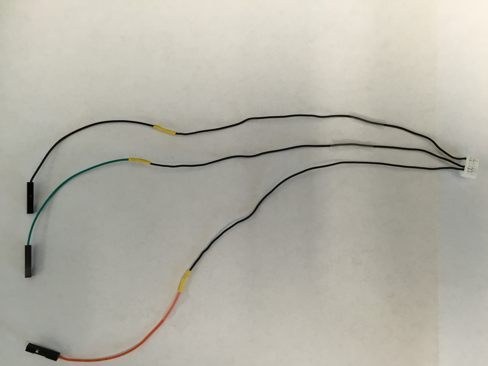
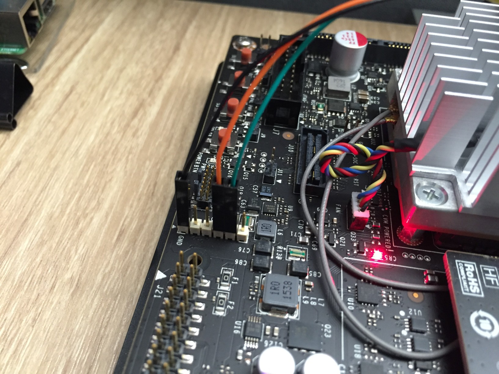

A simple way to connect Jetson SDK development board and Pixhawk is using dev board `J17` connector which provides serial interface. This interface accessed via `/dev/ttyTHS2` device in Linux. [Dev kit spec](http://developer.nvidia.com/embedded/dlc/jetson-tx1-tx2-developer-kit-carrier-board-spec-20170615) contains detailed information about the board but in short, you need to connect J17 and Pixhawk in the following way:
* Pin 1 J17 (`GND`) to pin 6 (`GND`) on Pixhawk TELEM2 port.
* Pin 4 J17 (`RX `) to pin 2 (`TX `) on Pixhawk TELEM2 port.
* Pin 5 J17 (`TX `) to pin 3 (`RX `) on Pixhawk TELEM2 port.

Example:
Cable:


Board J17:


Once the ports are connected, the quick way to test connectivity is to run MAVROS assuming that Pixhawk TELEM2 port is [setup correctly](../wiki/3DR-Iris-Setup#jetson-connectivity).

PX4 stack:
```
 roslaunch mavros px4.launch fcu_url:="/dev/ttyTHS2:921600" gcs_url:="udp://@YOUR_GCS_IP"
```

APM stack:
```
 roslaunch mavros apm.launch fcu_url:="/dev/ttyTHS2:921600" gcs_url:="udp://@YOUR_GCS_IP"
```

Replace `YOUR_GCS_IP` with IP of machine where QGroundControl is running, for example:
```
 roslaunch mavros apm.launch fcu_url:="/dev/ttyTHS2:921600" gcs_url:="udp://@10.42.0.211"
```

If everything is connected and configured properly, you should be able to run and connect QGroundControl to the Pixhawk. You can also check the output of MAVROS, it should look something like that (for APM):
```
...
[ INFO] [1513189530.955507488]: Known MAVLink dialects: common ardupilotmega ASLUAV autoquad matrixpilot paparazzi slugs standard uAvionix ualberta
[ INFO] [1513189530.955576800]: MAVROS started. MY ID 1.240, TARGET ID 1.1
[ INFO] [1513189531.011994048]: CON: Got HEARTBEAT, connected. FCU: ArduPilotMega / ArduCopter
[ WARN] [1513189531.215266432]: GP: No GPS fix
[ INFO] [1513189531.373249280]: RC_CHANNELS message detected!
[ INFO] [1513189532.035359552]: VER: 1.1: Capabilities         0x000000000000318f
[ INFO] [1513189532.035680832]: VER: 1.1: Flight software:     03020000 ( 22fe334)
[ INFO] [1513189532.036040736]: VER: 1.1: Middleware software: 00000000 ( 0384802)
[ INFO] [1513189532.036281696]: VER: 1.1: OS software:         00000000 ( 1bcae90)
[ INFO] [1513189532.036720928]: VER: 1.1: Board hardware:      00000000
[ INFO] [1513189532.036984768]: VER: 1.1: VID/PID:             0000:0000
[ INFO] [1513189532.037232480]: VER: 1.1: UID:                 0000000000000000
```
