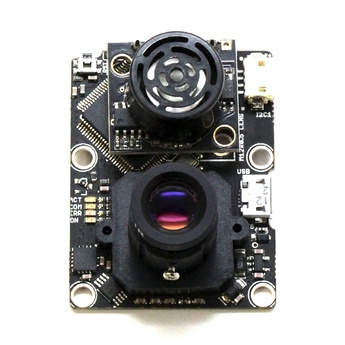
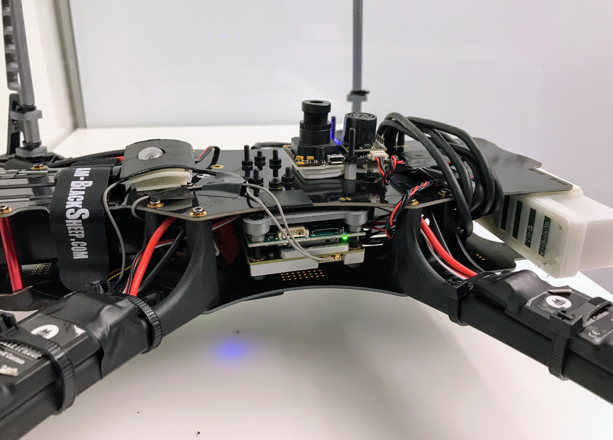
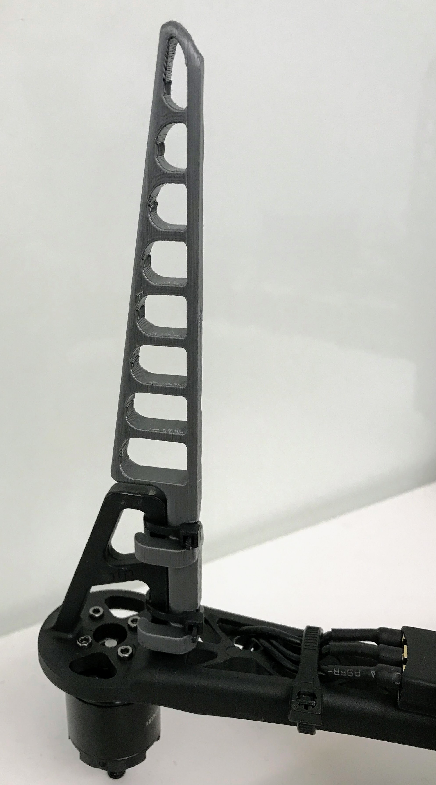

The drone should be able to fly in GPS-denied environments such as forests, tunnels, and inside of buildings. You can either use a visual SLAM system or external optical tracker for estimating drone's pose (see [PX4 tutorial](https://dev.px4.io/en/ros/external_position_estimation.html)) or you can use a [PX4FLOW](https://pixhawk.org/modules/px4flow) optical flow based sensor. 


The PX4FLOW sensor computes 2D optical flow, estimates distance to the ground, and fuses this data with IMU measurements to estimate the drone's velocity. The computed velocity is then fused in PixFalcon's Extended Kalman Filter to estimate the drone's position and orientation (see [PX4FLOW tutorial](https://dev.px4.io/en/tutorials/optical_flow.html)). PX4FLOW measurements can also be fused with GPS position data to help with GPS stabilized flight. We currently use PX4FLOW with the LPE pose estimator in a PX4 1.7.0 stack. 
The PX4FLOW is mounted on the bottom of the TBS discovery frame with its `Y` axis pointing in the direction of drone's `X` axis (its sonar should be facing the front of the drone). For best accuracy, the PX4FLOW sensor should be mounted as close as possible to the drone's center of gravity. The sensor is connected via an I2C cable to the I2C switch board that connects to PixFalcon I2C port.

**NOTE**: PX4FLOW sonar will not work at temperatures below 0C (32F) therefore we recommend using separate LIDAR Lite (or similar) for distance to the ground measurements.

### PX4FLOW Firmware  
We use the latest [PX4Flow firmware](https://github.com/PX4/Flow) with some modified parameters listed below.

We replaced stock 16 mm PX4FLOW lens with a wider angle 6 mm lens with an IR filter. If you do this, you need to change a default focal length in the PX4FLOW firmware code and re-build it before PX4FLOW flashing. The PX4FLOW camera focal length is set in `px4flow/src/modules/flow/settings.c` file as:
```C++
global_data.param[PARAM_FOCAL_LENGTH_MM] = 6.0f; // was 16.0f
```
PARAM_FOCAL_LENGTH_MM should be changed from 16.0f to whatever focal length (in mm) you have, i.e. 6.0f for 6 mm lens.
Increasing the field of view makes the sensor more stable when tracking the drone's pose over surfaces with less texture (concrete, office carpet, asphalt, etc.). Using an IR filter helps with ignoring the Lidar Lite spotlight if you use one for height measurements.

We also had to tweak the following parameters (in addtion to the PARAM_FOCAL_LENGTH_MM) in order to improve the accuracy of the PX4FLOW sensor. These settings can be found in `px4flow/src/modules/flow/settings.c` file
```C++
global_data.param[PARAM_BOTTOM_FLOW_FEATURE_THRESHOLD] = 20; // was 40
global_data.param[PARAM_EXPOSURE_MAX] = 2000; // was 500
global_data.param[PARAM_BRIGHT] = 15; // was 20
```
If you replicate our setup and would like to use the firmware we built, it can be downloaded from [redtail/tools/skypad/px4flow-v1_default.px4](../blob/master/tools/platforms/skypad/px4flow-v1_default.px4).

### Hardware setup
The PixFalcon/Pixhawk and PX4FLOW wiring is described in the [PX4](https://dev.px4.io/en/tutorials/optical_flow.html) documentation. Here is the example setup of PX4FLOW on the TBS discovery frame.



### Optical sensor image focusing and testing
Make sure that optical flow sensor camera is focused properly. We recommend using 6mm lens for better quality.
1. Connect the PX4FLOW sensor over micro USB to your PC
2. Open QGroundControl
3. Go to parameters and find the parameter `VIDEO_ONLY`. Set it to 1 and save.
4. At this point QGroundControl should show a video stream from the sensor. You can use it to focus the PX4FLOW camera.
5. Focus the camera (by rotating the focusing ring) at the expected working range (typically a distance of 1m). The image should not be blurry at that distance.
6. Fix the ring after focusing (either with a screw or a turn ring).
7. Set the parameter `VIDEO_ONLY` back to 0 and save.

At this point you can open Plots in QGroundControl and plot any event that starts with `FLOW_`. You can see if it estimates reasonable `XY` optical flow and `Z` distance to the floor.

### Landing Gear
Another problem that you will hit with using on TBS Discovery platform is the lack of vertical space below the drone.  Since the TBS discovery body leaves minimal clearance below the main body, we suggest **extending the landing gear** if you want to accommodate a PX4FLOW Camera. To extend the landing gear, you can use 3D-printed leg extensions (any extender designed for the F450 Flamewheel arms should work, e.g. https://www.thingiverse.com/thing:60722).   
We provide [an experimental model](../blob/master/tools/platforms/skypad/DJI%20F450%20Flamewheel%20Arm%20Extension.stl) for 3D-printable arm extensions in the main project repo, which can be snapped and zip-tied on to the existing leg mounts.  
Here's how we attached(zip tied) it.


---
<a rel="license" href="http://creativecommons.org/licenses/by/4.0/">
</a>
<br />This work is licensed under a <a rel="license" href="http://creativecommons.org/licenses/by/4.0/">Creative Commons Attribution 4.0 International License</a>
