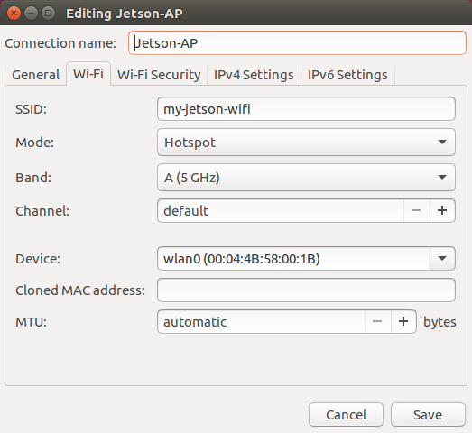

# Table of Contents

* [Main Software Setup](#main-software-setup)
    * [Jetson Software Setup](#jetson-software-setup)
    * [PixFalcon Software Setup](#pixfalcon-software-setup)
        * [Basic PixFalcon Setup](#basic-pixfalcon-setup)
        * [PixFalcon TELEM1 Port Setup](#pixfalcon-telem1-port-setup)
* [Optional ZED Setup](#optional-zed-setup)
    * [ZED Software Setup](#zed-software-setup)

# Main Software Setup

This section provides information regarding software setup of the Jetson and PixFalcon.

## Jetson Software Setup

1. Install[ JetPack L4T 3.1](https://developer.nvidia.com/embedded/jetpack) per the [Redtail Jetson-Setup](https://github.com/NVIDIA-Jetson/redtail/wiki/Jetson-Setup) guide, including the [J120 Jetson TX2 firmware patch](https://auvidea.com/firmware/).  Some components like **VisionWorks Pack** and **Compile CUDA Samples** can be skipped during the JetPack install process (right click on the "Action" field in the list of installation components) to save space.  The default username/password for the Jetson are `nvidia`/`nvidia`.

2. Create a Wi-Fi access point using the Ubuntu Network Manager (you may need to fix the `op_mode` parameter; see [this guide](https://elinux.org/Jetson/TX1_WiFi_Access_Point)).  For example:

   

   Once you've created a Wi-Fi access point, make sure that you can `ssh` into the Jetson by connecting to the Wi-Fi from your host computer and running `ssh nvidia@10.42.0.1`.  The Wi-Fi access point will be broadcast after every boot, allowing you to interact with the Jetson easily once it has been attached to the drone.


3. If you'd like to use PX4FLOW, ZED, ORB_SLAM2, or any other offboard control of the PixFalcon, we suggest using the setup script from the NVIDIA Redtail repo to install ROS and MAVROS.  This will install ROS and set up the ROS workspace in `~/ws/`.  Once the script is finished, log out and log back in to make sure that all ROS environment variables are initialized.

  ```bash
  cd ~
  git clone https://github.com/NVIDIA-Jetson/redtail.git
  ./redtail/ros/scripts/jetson_ros_install.sh
  ```

## PixFalcon Software Setup

### Basic PixFalcon Setup

1. Download and install [QGroundControl](http://qgroundcontrol.com/) on your host machine.
2. Connect the GPS/Compass to the PixFalcon.
3. Using the provided USB cable, connect the PixFalcon to your host machine, and launch QGroundControl.
4. Using QGroundControl, [install PX4 firmware](http://qgroundcontrol.com/loading-firmware/) [1.7.0](https://github.com/PX4/Firmware/releases/tag/v1.7.0). Install [px4fmu-v2_lpe.px4](https://github.com/PX4/Firmware/releases/download/v1.7.0/px4fmu-v2_lpe.px4), so that we can use PX4FLOW based position stablization.
5. Run through the [initial setup process](https://www.youtube.com/watch?v=91VGmdSlbo4) for the PixFalcon in QGroundControl. Please note that although the video uses Pixhawk, the process is completely identical for PixFalcon.
6. Run through the compass calibration process in QGroundControl as well.
7. Set the following parameters on the PixFalcon in QGroundControl. Optionally you can import these settings from the [redtail/tools/platforms/skypad/px4settings.params](../blob/master/tools/platforms/skypad/px4settings.params) file.

| Page | Parameter | Value |
| --- | --- | --- |
| Local Position Estimator | LPE_FAKE_ORIGIN | 1 |
| Local Position Estimator | LPE_FLW_QMIN | 75 |
| Local Position Estimator | LPE_FUSION | 210 (fuse optical flow, fuse land detector, flow gyro compensation, fuse baro) |
| Local Position Estimator | LPE_LAT | 0.0 deg |
| Local Position Estimator | LPE_LONG | 0.0 deg |
| Local Position Estimator | LPE_VXY_PUB | 0.8 m/s |
| Multicopter Position Control | MPC_TAKEOFF_ALT | 1.5 m |
| Multicopter Position Control | MPC_ALT_MODE | Terrain Following |
| Multicopter Position Control | MPC_XY_VEL_MAX | 2.0 m/s |
| Multicopter Position Control | MPC_XY_P | 0.5 |
| System | SYS_COMPANION | Companion Link (921600 baud, 8N1) |
| System | SYS_MC_EST_GROUP | local_position_estimator, attitude_estimator_q |

### PixFalcon TELEM1 Port Setup

To be able to communicate to the PixFalcon over the TELEM1 port, we need to change the port used by the PixFalcon’s MAVLink software.

1. Using a micro SD card reader, connect the PixFalcon’s micro SD card to your host computer for editing.

2. Create an `/etc/extras.txt` file on the PixFalcon card containing the following two lines:

    ```bash
    mavlink stop-all
    mavlink start -d /dev/ttyS1 -b 921600 -r 20000 -m onboard
    ```

Since MAVLink is now running on a different port, this change will disable QGroundControl over the Pixfalcon USB port. To control the PixFalcon from QGroundControl after performing this modification, either launch QGC on a host computer when connected to the Jetson's Wi-Fi hotspot (after starting MAVROS via SSH), or remove `extras.txt` from the SD card.

# Optional ZED Setup

The ZED camera can be used to provide stereo vision-based pose estimates to the PixFalcon.  Here, we provide introductory instructions for installing the basic ZED software and reading pose estimates.

## ZED Software Setup

To install and run the ZED software on Jetson:

1.  If you haven't already done so, run the Redtail ROS setup script:

    ```bash
    cd ~
    git clone https://github.com/NVIDIA-Jetson/redtail.git
    ./redtail/ros/scripts/jetson_ros_install.sh
    ```

2.  Set the Jetson to Max-N power mode (consuming more power, but improving performance).

    ```bash
    sudo nvpmodel -m 0
    ```

3.  Install packages required for the ZED:

    ```bash
    sudo apt-get install -y libcv-bridge-dev libeigen3-dev ros-kinetic-cv-bridge libpcl1 ros-kinetic-pcl-ros ros-kinetic-tf2-geometry-msgs ros-kinetic-tf-conversions ros-kinetic-rviz ros-kinetic-robot-state-publisher
    ```

4.  Connect the ZED camera to the Jetson carrier board USB3.0 port.

5.  With the ZED camera connected to the Jetson (so that the installer can identify the serial number and download the appropriate camera calibration file), install the ZED SDK for Jetson TX2 (saying yes to dependency installs when prompted):

    ```bash
    # Connect ZED camera!
    wget https://www.stereolabs.com/developers/downloads/ZED_SDK_Linux_JTX2_v2.2.1.run
    # If this link doesn't work, you can get the most recent SDK from https://www.stereolabs.com/developers/
    chmod +x ZED_SDK_Linux_JTX2_v2.2.1.run
    ./ZED_SDK_Linux_JTX2_v2.2.1.run
    ```

6.  Install the `zed-ros-wrapper` ROS package:

    ```bash
    cd ~/ws/src/
    git clone https://github.com/stereolabs/zed-ros-wrapper.git
    cd ..
    catkin_make
    source ./devel/setup.bash
    ```

7.  The `zed-ros-wrapper` package provides [helpful launch files](https://github.com/stereolabs/zed-ros-wrapper/tree/master/launch).  To test the ZED software, run `roslaunch zed_wrapper display.launch`.  To run the software (including odometry broadcasting), use `roslaunch zed_wrapper zed.launch`; the pose will be broadcast on the `odom` channel by default as an `Odometry` message (see the [launch file](https://github.com/stereolabs/zed-ros-wrapper/blob/master/launch/zed_camera.launch)), so you will need to rebroadcast it as a `PoseStamped` message to work with MAVROS.


---
<a rel="license" href="http://creativecommons.org/licenses/by/4.0/">
</a>
<br />This work is licensed under a <a rel="license" href="http://creativecommons.org/licenses/by/4.0/">Creative Commons Attribution 4.0 International License</a>