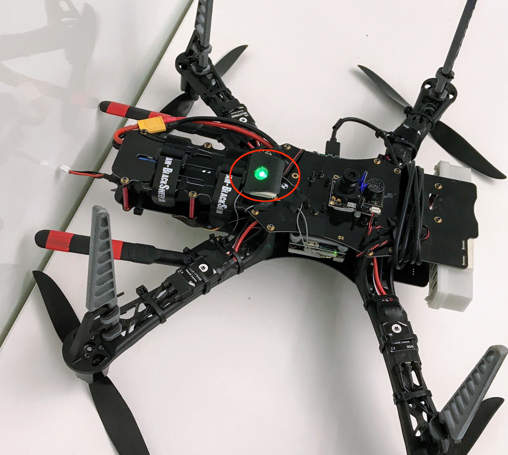

# Jetson UAV Reference Platform Assembly Guide (aka Skypad)

The following document explains how to augment a TBS Discovery drone with an NVIDIA Jetson TX2, using the Auvidea J120 carrier board.

It also covers (optionally) mounting a PX4FLOW optical flow module for visual stabilization and ZED stereo camera  connected to Jetson (pictured above).

The software configuration process (including information for the ZED camera) is documented in the accompanying [Software Setup Guide](Skypad-Software-Setup-Guide).  **We recommend completing all software setup before beginning hardware setup.**

Happy flying.

## Table of Contents

* [Materials](#materials)
* [Assembly 1: Jetson Attachment](#assembly-1-jetson-attachment)
* [Assembly 2: Jetson + J120 Connections](#assembly-2-jetson--j120-connections)
    * [1: Internet from Antennae to Jetson](#1-internet-from-antennae-to-jetson)
    * [2: Power from Frame to J120](#2-power-from-frame-to-j120)
    * [3: Control from J120 to PixFalcon](#3-control-from-j120-to-pixfalcon)
    * [4: Flight Controller to Power Module, ESCs, Compass, and RC Receiver](#4-flight-controller-to-power-module-escs-compass-and-rc-receiver)
        * [Power Module / PDB](#power-module--pdb)
        * [8 Channel PWM Board](#8-channel-pwm-board)
        * [Attaching Compass, RC Receiver, and PixFalcon](#attaching-compass-rc-receiver-and-pixfalcon)
        * [Attaching the LED indicator](#attaching-the-led-indicator)       
* [Assembly 3: Verification, Testing, and Startup](#assembly-3-verification-testing-and-startup)
* [Landing Gear](#landing-gear)
* [Software Setup Guide](Skypad-Software-Setup-Guide)
* [Optional PX4FLOW Build](Skypad-Optional-PX4Flow-Build)
* [Optional ZED Camera Build](Skypad-Optional-ZED-Camera-Build)

## Materials

* **Primary Components**:

    * **[NVIDIA Jetson TX2 Developer Kit](https://developer.nvidia.com/embedded/buy/jetson-tx2-devkit)**:
        A TX1 can also be used (the dimensions are identical), but some software settings may be different.
        The developer kit includes the following necessary components:

        * NVIDIA Jetson TX2
        * 2x Mini PCIe Wi-Fi Antenna

    * **TBS Discovery Components**:
        You do *not* need the TBS CORE or pin headers for the TBS Discovery Frame.
        The TBS guide includes a list of compatible parts on page 26 of the [TBS Discovery Manual](http://www.team-blacksheep.com/tbs-discovery-manual.pdf).  The main components you need are:

        * TBS Discovery Frame (Top / bottom plate, aluminum spacers, and screws)
        * 4x DJI F450 Flamewheel Arms
        * 4x 400Hz Multirotor Speed Controllers (18-30A) (We used TBS Bulletproof ESCs)
        * 4x 750 to 900kV Brushless Motors (We used TBS 900kv2 Motors)
        * 4x 9x5 or 10X5 Graupner E-Prop Propellers (2x CW, 2x CCW)
        * 12x Zip Ties
        * R/C Receiver (5 Channels or more)
        * R/C Transmitter (5 Channels or more)

    * **Battery Supplies**:

        * 3S 5000-6000mAh or 4S 2800-4500mAh LiPo battery
        * 2x Medium velcro LiPo battery straps
        * LiPo battery charging station

    * **PixFalcon with GPS+PDB**:
        Although we tested with the PixFalcon, a (larger) PixHawk should work as well, avoiding the need to splice connector wires during the build (see [this section](#3-control-from-j120-to-pixfalcon) for information about the wire splicing required).
        The PixFalcon with GPS+PDB includes the following necessary components:

        * PixFalcon Micro PX4 Autopilot
        * Micro M8N GPS/Compass
        * Mega PBD Power Module
        * 8 Channel PWM Breakout board (for ESC connection) 
        * Cables for the above components

    * **Auvidea J120 TX1/TX2 Carrier Board**:
        Includes the following necessary components:

        * Auvidea J120
        * Pre-crimped cable kit (several JST GH connectors and pre-crimped wires).

* **Misc Components**

    * PixFalcon to J120 cable components for cable splicing (not needed if using PixHawk, or if you're willing to repurpose the 4-pin SH connector provided with the PixFalcon):
      * [3x JST SH pre-crimped wires](https://www.digikey.com/product-detail/en/jst-sales-america-inc/ASSHSSH28K51/455-3075-ND/6009451)
      * [1x JST SH wire housing](https://www.digikey.com/product-detail/en/jst-sales-america-inc/SHR-04V-S/455-1394-ND/759883)
    * Jetson mount bolts:
      * 10x M3 bolts, 8-10mm, with corresponding nuts (to attach the Jetson mount to TBS frame)
      * 4x M3 bolts, 25-30mm, with corresponding nuts (to attach the Jetson and J120 to the Jetson mount)
    * 4x Zip Ties (to attach the Wi-Fi antennae)

* **Essential Tools**

    * T10 Torx screwdriver (for removing Jetson from the provided carrier board)
    * M3 crosshead screwdriver (for removing the Jetson heat sink)
    * 3D printer or 3D printing service (for printing Jetson mount)
    * Soldering equipment (for attaching power cables and splicing wires)
    * Micro SD card reader (for modifying the PixFalcon software)
    * Double-sided adhesive (we used 3M double-coated urethane foam tape) for attaching components
    * Electrical tape for attaching components

* **Useful Tools**

    * Jetson peripherals (if you don't want to SSH in from the host computer)

        * Keyboard

        * Mouse

        * USB-3 Hub

        * Monitor

        * HDMI cable

        * Ethernet cable

    * Multimeter (for testing TBS discovery power terminals during build)

    * Wire cutters and wire strippers (for cable soldering)

## Assembly 1: Jetson Attachment

1. If the TBS Discovery frame is not already assembled, assemble it according to their [provided video](https://www.youtube.com/watch?v=BqAhJv32vlQ) and [assembly manual](http://www.team-blacksheep.com/tbs-discovery-manual.pdf), with the following adjustments:

    1. You do not need to attach the top plate yet–this will happen in [Assembly 3](#3-control-from-j120-to-pixfalcon).

    2. You do not need to attach/solder the TBS CORE, the TBS CORE pin headers, or the R/C pin headers; the top plate can be entirely unpowered.

    3. **Power Module / PDB:** You should solder wires between the PixFalcon power module/PDB and the square +/- terminals on the bottom plate (this is shown in the [TBS assembly video](https://youtu.be/BqAhJv32vlQ?t=3m37s), but using NAZA power cables rather than PixFalcon PDB power cables in their case).  

       The + terminal on the frame should be connected to the "Input +" terminal on the PDB, and the - terminal on the frame should be connected to the “Input -” terminal on the PDB.  The PDB will be used to power the PixFalcon in [Assembly 2](#power-module--pdb).  
       ​
       For example, our PDB soldering looks like this:

       

    4. **Power From Frame to J120:** Using red and black pre-crimped wires from the J120 cable kit, solder 2 pre-crimped wires to the other set of square +/- terminals on the bottom plate (or to one of the forward ESC power terminals; red wire to +, black wire to -).  

       You can also attach the 4-pin cable ending at this stage if you want; instructions for how to do so are included later in [Assembly 2](#2-power-from-frame-to-j120). 

       These wires will be used to provide 12V power to the J120/Jetson later in the build.  For example, our soldering to the front-left ESC terminal looks like this (shown with the Jetson/J120 attached):

       

2. 3D-print the [Jetson Mount](../blob/master/tools/platforms/skypad/NVIDIA%20Jetson%20Mount.stl) provided in this repo.  You can use your own printer or order a print using a service like [Shapeways](shapeways.com).
  

3. Before attaching the Jetson to the J120 carrier board, make sure you've finished the [Software Setup Guide](Skypad-Software-Setup-Guide) (you can SSH into the mounted drone, but doing installs and compilations on the original carrier board, with wall-current power and a full fan/heatsink, is much more convenient).

4. Once the software is installed and tested, unclip the Jetson antenna cables from the Jetson, unscrew the Jetson from the original base plate, remove the heatsink, and snap the Jetson on to the J120 carrier board.
  

5. Remove the top plate of the TBS Discovery (it attached) and align the 3D-printed mount to the bottom plate, with the large M3 bolts pre-inserted into the four corner-standoffs of the mount. Attach the mount to the discovery using the small M3 nuts and bolts.

6. Mount the Jetson and J120 onto the exposed bolts, then use the nuts to hold everything in place. Make sure to orient the J120 with the row of ports facing towards the front of the drone (so that the power cable  can reach).
    

7. Do not reattach the top plate yet; this will happen in the next section.

## Assembly 2: Jetson + J120 Connections

In order to fly the drone from the Jetson TX2 on the Auvidea J120 carrier board, the following connections need to be made:

1. **Internet from Antennae to Jetson:** in order to monitor and control the Jetson remotely, the Jetson’s Wi-Fi antennae must be wired up and attached to the frame.

2. **Power from Frame to J120:** the J120 draws 12V power directly from the TBS frame. The necessary cable can be constructed using parts provided in the J120 cable kit (a small plastic bag of cables and connectors included in the J120 box).

3. **Control from J120 to PixFalcon:** the J120 forwards control signals from the Jetson to the flight controller. Due to differences in wire diameter between the J120 and PixFalcon ports, this cable must be spliced and soldered by hand.

4. **Flight Controller to Compass, RC Receiver, power, and ESCs:** the PixFalcon flight controller needs four additional connections.

We will cover the process for each of the above four connections separately.

A completed wiring diagram for the components we add in this section is below (cable lengths not to scale):

For reference, here's what the wiring looks like without the frame (Wi-Fi antennae not shown):

### 1: Internet from Antennae to Jetson

1. Unpack the Wi-Fi antennae from the TX2 box.

2. Unscrew the antenna cables from the TX2 devkit board, and screw the antennae onto the TX2’s antenna cables.

3. Using zip-ties and electrical tape, secure the antennae onto the arms of the drone, making sure that the antennae can't rotate upwards and interfere with the propellers.  Suggested zip-tie placements are indicated with arrows below.

4. Take the free ends of the antennae cables and snap them back onto the Jetson.  Having a screwdriver or pen tip available to press down the terminals may be helpful.
   

### 2: Power from Frame to J120

1. Using one four-pin JST GH jack, create the following cable ending from the pre-crimped wires soldered to power power terminals on the TBS frame (see [Assembly 1](#assembly-1-jetson-attachment)).  The red wire should connect to a negative (–) terminal on the frame, and the red wire should connect to a positive (+) terminal, with the wires embedded in the 4-pin jack as follows:

2. Attach the end to the J120 12V power port (rightmost on the row of white connectors, labeled as "12V").

For reference, here is the full pinout of the J120 power connector:

***

<table>
  <tr>
    <td>1</td>
    <td>2</td>
    <td>3</td>
    <td>4</td>
  </tr>
  <tr>
    <td>Power In</td>
    <td>Power In</td>
    <td>GND</td>
    <td>GND</td>
  </tr>
</table>

### 3: Control from J120 to PixFalcon

This cable is somewhat tricky to prepare, since the PixFalcon telemetry port uses a 1mm pitch [JST SH](http://www.jst-mfg.com/product/detail_e.php?series=231) connector, but the J120 uses a 1.25mm pitch [JST GH](http://www.jst-mfg.com/product/detail_e.php?series=105) (compatible with Pico Microblade) connector, so the diameters of pre-crimped wires will not match up. 

We suggest soldering together pre-crimped wires of both sizes to create a composite cable (you can use the 4-pin cable provided with the PixFalcon as the SH end):

1. Collect a six-pin connector and three pre-crimped wires from the J120 cable kit, as well as a three-pin JST SH connector and three pre-crimped JST SH wires (purchased separately; see the [materials list](#materials)).

2. Cut one end off of each of the six pre-crimped wires and strip a bit of the casing, leaving some exposed wire to solder.

3. Solder each of the J120-provided wires to a different JST SH wire.

4. Snap the pre-crimped wires into the connectors using the following wiring reference (noting the connector orientation and annotations–A should connect to A, B to B, and C to C): 

5. Attach the corresponding connector to the UART0/2 port (directly right of the Micro-USB port) on the J120.  We will attach the PixFalcon end in the next section.

For reference, here are the full pinouts for the devices on each end of the cable; note that:

* The TX pin on one device goes to the RX pin on the other.

* The UART0 pins should not be used; only use UART2, as we’ve done in our reference cable.

* The PixFalcon connector in our reference cable photo is oriented "upside down" with respect to the pinout.

**J120:**

<table>
  <tr>
    <td>1</td>
    <td>2</td>
    <td>3</td>
    <td>4</td>
    <td>5</td>
    <td>6</td>
  </tr>
  <tr>
    <td>VCC (+5V)</td>
    <td>UART0 TX</td>
    <td>UART0 RX</td>
    <td>UART2 TX (OUT)</td>
    <td>UART2 RX (IN)</td>
    <td>GND</td>
  </tr>
</table>

**PixFalcon:**

<table>
  <tr>
    <td>1</td>
    <td>2</td>
    <td>3</td>
    <td>4</td>
  </tr>
  <tr>
    <td>VCC (+5V)</td>
    <td>UART TX (OUT)</td>
    <td>UART RX (IN)</td>
    <td>GND</td>
  </tr>
</table>

### 4: Flight Controller to Power Module, ESCs, Compass, and RC Receiver

The PixFalcon flight controller requires several connections to other components on the quadcopter. Here are the completed PixFalcon connections:

We recommend mounting the PixFalcon on the top plate, directly above the center of mass, as pictured above. Since many components the PixFalcon connects to are on the *inside* of the quadcopter (between the two plates), we suggest attaching cables to these interior components first, attaching the top plate, threading the cables through the frame, and then finally connecting the free ends of the connectors to the PixFalcon.

#### Power Module / PDB

To power the PixFalcon, we need to attach it to the power module.

The power module should already be wired to terminals on the TBS Discovery frame (See [Assembly 1](#assembly-1-jetson-attachment)).

We recommend attaching the power module to the bottom of the top plate with double-sided adhesive and electrical tape, to leave room on the bottom for the Jetson.

Once the power module is secured to the bottom of the top plate, connect one end of the 6-pin connector (included with the power module) to the power module, and thread the other end onto the other side of the top plate so that it can be attached to the PixFalcon.

#### 8 Channel PWM Board

To allow the PixFalcon to send signals to the ESCs and fly the quadcopter, we need to connect each of the ESCs to the 8 channel PWM board in the correct sequence, and connect the 8 channel PWM board to the PixFalcon.  

1. Identify the PWM board and ESC cables, and connect them as follows (per the [PX4 airframe reference](https://dev.px4.io/en/airframes/airframe_reference.html#quadrotor-wide)):
   

   

2. Connect the provided 10-pin connector cable to the 8-channel PWM board, and arrange the board so that the cable can be threaded through the plate opening on back-left (#2) arm.  This will allow the cable to reach a PixFalcon center-mounted on the top plate.

   

#### Attaching Compass, RC Receiver, and PixFalcon

These final components can be directly mounted on the top plate using double-sided adhesive.  

1. Mount the PixFalcon over the center six screws facing forwards.  The PixFalcon includes two strips of double-sided foam adhesive which are ideal for mounting.  While attaching adhesive, make sure _not_ to cover the screw holes which correspond to the 2 center struts.
2. Using the free ends of cables attached in earlier steps, connect the MAIN OUT (10 pin connector to 8 Channel PWM Board), TELEM (spliced connector cable to J120) and PM (6-pin connector from power module) cables. 
3. Mount the RC receiver on the tail of the quadcopter, and connect it to the RCIN connector on the PixFalcon. 
4. Mount the GPS / Compass on the back of the quadcopter (behind PixFalcon) on top of an RF shield (foil) mounted on the top plate. GPS / Compass must face forwards and be connected to the GPS&I2C connector on the PixFalcon. It is important to use an RF shield below GPS / Compass due to presence of radio interference from USB3 connector on the carrier board (where USB camera is plugged). Absence of the RF shield may lead to poor GPS / Compass accuracy. Any thick foil is sufficient for this purpose (see photo)

#### Attaching the LED indicator
Since the PixFalcon is mounted on the upper side of the frame, the LED on the PixFalcon will not be visible during the flight. We suggest mounting an [external LED](http://ardupilot.org/copter/docs/common-external-leds.html) on the bottom, so that the PixFalcon status is visble from the ground. The LED connects to the PixFalcon on the I2C port. If you have multiple devices that need to be connected to the I2C port, consider using an [I2C splitter](https://pixhawk.org/peripherals/i2c_splitter). 
Here's a picture of the bottom of our frame that shows the LED placement. 

## Assembly 3: Verification, Testing, and Startup

To complete the assembly, re-attach the top plate:

1. Screw in the 2 center struts to the top plate.
2. If detached, re-adhere the PixFalcon to the top plate.
3. Screw in the 4 back struts and 2 front struts to the top plate.
4. Screw in the arms to the top plate.

For detailed testing and startup information, we recommend reading through the following documents:

*   **The "First Flight" section of the [TBS Discovery manual](http://www.team-blacksheep.com/tbs-discovery-manual.pdf).**
*   **The "Basic Configuration" and "Flying" sections of the [PX4 documentation](https://docs.px4.io/en/config/).**
*   **The "Launch Sequence and Flying" section of the [Redtail wiki](https://github.com/NVIDIA-Jetson/redtail/wiki/Launch-Sequence-and-Flying).**

Some basic tests to run through (without props) include:

-   Testing that the drone is reasonably well-balanced (by holding opposing arms and testing that the drone does not tip forward or backwards)
-   Testing that the battery and camera are properly secured and will not fall out during flight.
-   Testing that the PixFalcon and NVIDIA Jetson TX2 can both be powered on using battery power.
-   Testing that the PixFalcon responds to RC control.
-   Testing that the motors are spinning in the correct orientation and responding correctly to throttle/directional commands (since should be no props on during testing, you can check motor direction and speed by holding the edge of a piece of paper against the spinning motor).
-   Testing that your transmitter's kill switch works properly.
-   Testing that you can connect to the Jetson's Wi-Fi network, even from a reasonable distance away.
-   Testing (optional) PX4FLOW visual odometry in QGroundControl

Additionally, before flight, we suggest:

-   Making sure that the PixFalcon is able to acquire a GPS signal.
-   Making sure that the clockwise/counter-clockwise propellers are attached to the [appropriate motors](https://dev.px4.io/en/airframes/airframe_reference.html#quadrotor-wide).
-   Making sure that the battery is fully charged.
-   Doing a preliminary, short manually-controlled flight in an open, obstacle-free space with a safety tether tied to the bottom/side of the drone (and at a reasonable distance away).

## Landing Gear
If you are attaching PX4FLOW sensor or Lidar Lite, there is not enough room below the drone. We suggest **extending the landing gear** to create extra vertical space below the frame.  
To extend the landing gear, you can use 3D-printed leg extensions (any extender designed for the F450 Flamewheel arms should work, e.g. https://www.thingiverse.com/thing:60722).  
We provide [an experimental model](../blob/master/tools/platforms/skypad/DJI%20F450%20Flamewheel%20Arm%20Extension.stl) for 3D-printable arm extensions in the main project repo, which can be snapped and zip-tied on to the existing leg mounts.  
Here's how we attached(zip tied) it.

---

 This work is licensed under a <a rel="license" href="http://creativecommons.org/licenses/by/4.0/">Creative Commons Attribution 4.0 International License</a>