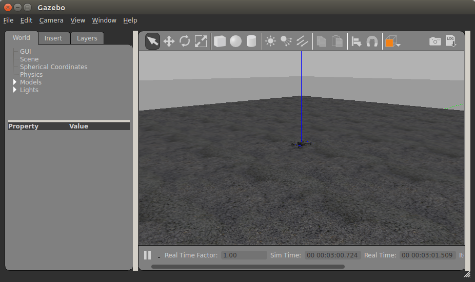
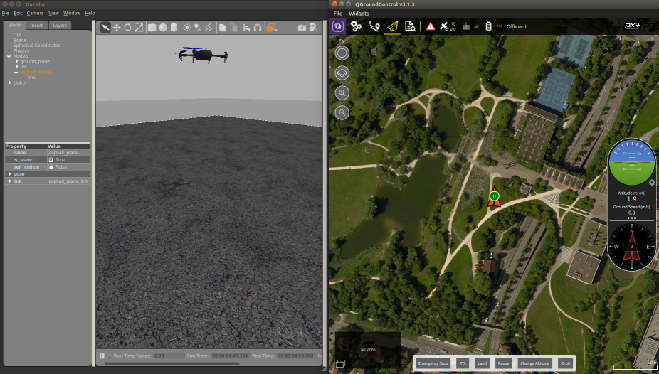
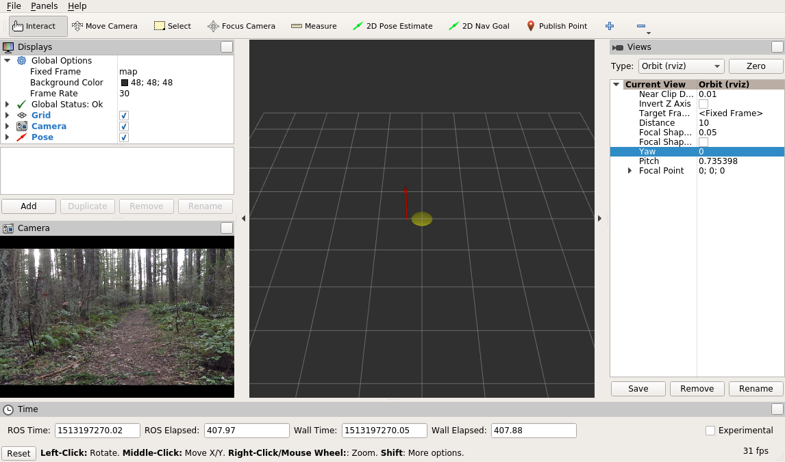

Testing the code in the simulator is generally a good idea that helps to avoid expensive hardware failures. [Docker](https://www.docker.com) is the preferred way to set up a simulation environment as it allows the user to completely isolate all software changes from the host system, as well as have multiple simulation environments on the same machine. This document describes how to setup a Gazebo simulation platform that enables SITL (Software-In-The-Loop) testing of the project's code. There are 2 ways to use Docker for simulation: Redtail Docker image (step 1 below) or build the image manually (steps 2-6 below).

The current configuration assumes all components are installed on a x86 host platform running Ubuntu 16.04. It is also possible to install some components on Jetson while others (like Gazebo etc) - on the host machine. 

1. [Using Redtail Docker](#redtail-docker)
2. [PX4 and ROS Docker setup](#px4-and-ros-docker-setup)
    1. [NVIDIA GPU and CUDA support](#nvidia-gpu-and-cuda-support-optional)
3. [Building PX4 software stack](#building-px4-software-stack)
4. [Connecting QGroundControl to simulator](#connecting-qgroundcontrol-to-simulator)
5. [Building controller code](#building-controller-code)
6. [Configuring joystick](#configuring-joystick)
7. [Running the controller](#running-the-controller)
    1. [Running the controller only](#running-the-controller-only)
    2. [Running DNN and controller nodes](#running-dnn-and-controller-nodes)
8. [RViz visualization](#rviz-visualization)
9. [Installing Visual Studio Code (optional)](#installing-visual-studio-code)

# Redtail Docker
Redtail Docker image contains all the components required to run full Redtail simulation, such as ROS Kinetic, Gazebo, PX4 stack, CUDA with cuDNN and TensorRT, GStreamer and others. Containers created from the image allow to run ROS nodes such as DNN, controller, camera and joystick as well as debug system behavior in Gazebo simulator. The image requires NVIDIA GPU to be present as well [NVIDIA Docker](https://github.com/NVIDIA/nvidia-docker/) installed. The steps below describe how to build an image and create a container. Note that this setup was tested with NVIDIA Docker v1. There are known issues with v2 (e.g. no OpenGL drivers etc) so, if possible, try using v1 for full-featured experience.
## Building Docker image
The Redtail image is currently not on the Docker Hub so you will have to build it first. Redtail project uses [NVIDIA TensorRT 3.0](https://developer.nvidia.com/tensorrt) library which has to be downloaded first. Make sure to download **TensorRT 3.0.4 for Ubuntu 16.04 and CUDA 9.0** tar package.

Next, go to `redtail/tools/simulation/docker` and run the build script:
```
./build_redtail_image.sh <path to TensorRT-3.0.4 tar file>
```
Building the image may take some time. Once the build is finished, verify it by running `docker images` command:
```
$ docker images
REPOSITORY                     TAG                            IMAGE ID            CREATED             SIZE
nvidia-redtail-sim             kinetic-v2                     b23157eb05e7        21 hours ago        7.59GB

```

## Creating container
To create a container, navigate to `redtail/tools/simulation` and run `run_redtail_docker.sh` script. The script has 3 optional parameters:
```
run_redtail_docker.sh [container_name] [host_data_dir] [container_data_dir] 
```
where `container_name` is the name of the container (default: `redtail-sim`), `host_data_dir` is the full path to a directory on the host to mount into the container (default: `/data`), `container_data_dir` is the full path to directory in the container to which `host_data_dir` will be mapped (default: `/data`)

**Note**: make sure to connect all devices like camera or joystick **before** starting the container.

## Building components
The container has catkin workspace created at `~/ws`. The workspace contains all components except Redtail source code. Redtail sources might be located on the host and shared among all the containers. To create proper symlinks to catkin workspace and build the components, run the following script from the container:
```sh
~/build_redtail.sh /data/src/redtail
```
Replace path as needed.

## Running components
There are several components that need to be run, usually from different terminal windows connected to the same container.
### Running Gazebo simulator
```sh
cd ~/px4/Firmware/
make posix_sitl_default gazebo
```
Once the build is finished, Gazebo window should appear with 3DR Iris drone model. Follow the [steps](#testing-gazebo) to take off and land the drone.

### Running MAVROS
Open a new terminal window and run `run_redtail_docker.sh` script again to connect to existing running container. If you used default container name (`redtail-sim`) no parameters are required to run the script. Once in the container, run:
```sh
cd ${CATKIN_WS}/
roslaunch mavros px4.launch fcu_url:="udp://:14540@127.0.0.1:14557" gcs_url:="udp://@172.17.0.1"
```
If you run QGroundControl now, it should be able to successfully connect to the vehicle.

### Running Redtail components
#### Running controller and joystick
In another terminal window connected to the running container:
```sh 
cd ${CATKIN_WS}/
rosrun joy joy_node _dev:=/dev/input/js0 _autorepeat_rate:=30 &
rosrun px4_controller px4_controller_node _altitude_gain:=2
```
Switch to Gazebo window and wait a little bit. The drone should take off and you should be able to control it with the joystick. Note that default joystick type is NVIDIA Shield, if you have a XBox then pass the appropriate `joy_type` parameter to the px4 controller node.

Follow [these steps](#running-dnn-and-controller-nodes) to run DNN and image publishing components (note: you don't need to create symlinks so skip step 1). As an alternative to `image_pub` node, a real camera can be used via `gscam` ROS node, for example:
```sh
cd ${CATKIN_WS}/
export GSCAM_CONFIG="v4l2src device=/dev/video0 ! video/x-raw, width=640, height=360 ! videoconvert"
rosrun gscam gscam
```
Another option would be using pre-recorded rosbag files, refer to [ROS wiki](http://wiki.ros.org/rosbag) for more information.

# PX4 and ROS Docker setup
In case Redtail Docker image cannot be used, there is an option to build the image manually. The following sections describe such process. Docker Hub contains a [px4-dev-ros image](https://hub.docker.com/r/px4io/px4-dev-ros/) which includes the PX4 firmware, simulation tools, and ROS Indigo. 
Follow the instructions on the [PX4 developer](https://dev.px4.io/en/test_and_ci/docker.html) page to create a Docker container.

**Note**: make sure to pull `px4io/px4-dev-ros:v1.0` rather than the `latest` tag.

The `tools/simulation/run_px4_docker.sh` script simplifies creating a new/attaching to existing Docker container. The script has 4 optional parameters:
```
run_px4_docker.sh [container_name] [host_data_dir] [container_data_dir] [NVIDIA_named_volume]
```
where `container_name` is the name of the container (default: `px4-ros`), `host_data_dir` is the full path to a directory on the host to mount into the container (default: `/data`), `container_data_dir` is the full path to directory in the container to which `host_data_dir` will be mapped (default: `/data`) and `NVIDIA_named_volume` is the name of the volume to map NVIDIA drivers (see below).

Mapping a directory from the host to the container allows easy sharing of source code and data between different containers.

Proper mapping of NVIDIA drivers is necessary to enable running a full simulation (DNN + controller).

## NVIDIA GPU and CUDA support (optional)
Running the script in default configuration creates a container that can be used to run and debug the controller only. If you wish to run a DNN node in the simulator, some additional steps are required. Such configuration requires NVIDIA GPU with the [latest drivers](http://www.nvidia.com/Download/index.aspx) as well as [NVIDIA Docker](https://github.com/NVIDIA/nvidia-docker).

### Creating container with NVIDIA GPU support
1. Find out which Docker named volume is mapped to the currently installed version of the drivers:
    ```
    docker volume ls
    ```
    Example of the output: 
    ```
    DRIVER              VOLUME NAME
    nvidia-docker       nvidia_driver_378.13
    ```
    This is the named volume created by NVIDIA Docker. Make sure that the version of the volume matches the version of the NVIDIA driver on the host machine. The driver version can be obtained by running `nvidia-smi` command.
2. Run `run_px4_docker.sh` with all 4 parameters, last parameter is the name of the volume (`nvidia_driver_378.13`), for example:
    ```sh
    ./run_px4_docker.sh px4-ros-cuda /data/ /data/ nvidia_driver_378.13
    ```
3. Once in the container, run the following commands to update required environment variables in the `.bashrc` file:
    ```sh
    echo "export PATH=\$PATH:/usr/local/nvidia/bin:/usr/local/cuda/bin" >> $HOME/.bashrc
    echo "export LD_LIBRARY_PATH=\$LD_LIBRARY_PATH:/usr/local/nvidia/lib64:/usr/local/cuda/lib64" >> $HOME/.bashrc
    echo "export LIBRARY_PATH=\$LIBRARY_PATH:/usr/local/cuda/lib64/stubs" >> $HOME/.bashrc
    ```
4. Exit the container and restart and re-attach by running:
    ```sh
    ./run_px4_docker.sh px4-ros-cuda
    ```
5. Once in the container, verify that GPU can be accessed by running `nvidia-smi` utility.

### Installing CUDA Toolkit
Download [CUDA Toolkit 8.0](https://developer.nvidia.com/cuda-downloads) for Ubuntu 14.04 (.runfile). The package comes with the CUDA Toolkit, samples, and the driver. Only the toolkit needs to be installed; do not install the drivers (samples are optional). Command line example:
```sh
./cuda_8.0.61_375.26_linux.run --silent --toolkit
```
Verify that you can run NVCC compiler by running `nvcc --version`.

### Installing cuDNN
Download [cuDNN v6](https://developer.nvidia.com/cudnn) and install the Debian package for CUDA 8.0 (Runtime library).  For example:
```sh
dpkg -i libcudnn6_6.0.21-1+cuda8.0_amd64.deb 
```
Verify that the package was installed successfully:
```
dpkg -l | grep cudnn
```

### Installing TensorRT
Download the [TensorRT v2](https://developer.nvidia.com/tensorrt) tar file for CUDA 8.0. Installing from the tar file is recommended as Debian package installation is known to have some issues. Unpack the file and update your environment variables:
```sh
TENSORRT_BASE_DIR=/opt/tensorrt
TENSORRT_DIR=${TENSORRT_BASE_DIR}/TensorRT-2.1.2
tar -xf TensorRT-2.1.2.x86_64.cuda-8.0-14-04.tar.bz2 -C ${TENSORRT_BASE_DIR}
echo "export LD_LIBRARY_PATH=\$LD_LIBRARY_PATH:${TENSORRT_DIR}/lib" >> $HOME/.bashrc
echo "export LIBRARY_PATH=\$LIBRARY_PATH:${TENSORRT_DIR}/lib" >> $HOME/.bashrc
echo "export CPATH=\$CPATH:${TENSORRT_DIR}/include" >> $HOME/.bashrc
```
Verify the installation by running `giexec` utility:
```
${TENSORRT_DIR}/bin/giexec
```

### Installing OpenCV with CUDA support
The DNN node requires OpenCV with CUDA support to be installed. There is already OpenCV 2.4 in installed in the container but it is compiled without CUDA support. Follow the steps below to build and install OpenCV 2.4 from sources:
```sh
cd ~
git clone https://github.com/opencv/opencv.git
cd opencv
git checkout 2.4.13.2
mkdir build
cd build
cmake -D CMAKE_BUILD_TYPE=RELEASE \
    -D CMAKE_INSTALL_PREFIX=/usr/local \
    -D WITH_CUDA=ON \
    -D ENABLE_FAST_MATH=1 \
    -D CUDA_FAST_MATH=1 \
    -D WITH_CUBLAS=1 \
    ..
make -j4
make install
```
**Note**: in case the build fails, add the following snippet to the `cmake` command and try again:
```
-D CUDA_CUDA_LIBRARY=/usr/local/cuda/lib64/stubs/libcuda.so
```

# Building PX4 software stack
## Update GCC
The following commands install the latest version of GCC 5 and make it the default compiler. You need to run these commands in the **container** only once, after creating a new container.
```
add-apt-repository ppa:ubuntu-toolchain-r/test
apt-get update
apt-get install gcc-5 g++-5
update-alternatives --install /usr/bin/gcc gcc /usr/bin/gcc-5 60 --slave /usr/bin/g++ g++ /usr/bin/g++-5
```
## Build PX4 code
Get the PX4 Firmware sources. In these instructions, we assume there is a directory `/data/` on the host which is mapped to `/data/` in the container.
Run the following from the **container**:
```sh
mkdir -p /data/src/px4/
cd /data/src/px4/
git clone https://github.com/PX4/Firmware.git
cd Firmware/
git checkout v1.4.4
make posix_sitl_default gazebo
```
### Testing Gazebo
Once the build is finished, the Gazebo simulator will be launched with a pre-loaded 3DR Iris model. It should look something like this:



To test if everything is working properly, try taking off the drone via the command line. In the container window, press enter (`pxh>` prompt should appear) and type:
```
commander takeoff
```
In the Gazebo window you should see the drone taking off. To land the drone, type
```
commander land
```

# Connecting QGroundControl to simulator
The QGroundControl GCS can be connected to the MAVROS instance running in the container.
1. Start/attach to the container and run MAVROS node with `gcs_url` argument:
    ```
    roslaunch mavros px4.launch fcu_url:="udp://:14540@127.0.0.1:14557" gcs_url:="udp://@172.17.0.1"
    ```
    You may need to replace the IP address of the host; check the output of `ifconfig` or `ip addr show` to get your Docker host IP.

2. Run QGroundControl on the host. It should automatically connect to the simulator running in Docker.
Try running `commander` commands in the Gazebo command line and observe the changes in QGroundControl.

# Building controller code
To build and run the controller code, some additional dependencies need to be installed in the **container**.
## Create workspace
The following commands create a catkin workspace and build the controller. The script assumes project sources are located at `/redtail`. You need to run these commands only once, after creating a new container.
```
CATKIN_WS=${HOME}/ws
mkdir -p ${CATKIN_WS}/src
cd ${CATKIN_WS}/src
catkin_init_workspace
git clone https://github.com/ros/angles.git
ln -s /redtail/ros/packages/px4_controller ${CATKIN_WS}/src/
```
## Build the code
```
cd ${CATKIN_WS}
catkin_make
```
After building the code, run the following `source` command to load ROS environment variables for the workspace:
```
source ${CATKIN_WS}/devel/setup.bash
```
To avoid doing this on each login, update `.bashrc` file:
```
echo "export CATKIN_WS=\${HOME}/ws" >> ${HOME}/.bashrc
echo "source \${CATKIN_WS}/devel/setup.bash" >> ${HOME}/.bashrc
```
Do not forget to build the controller with `catkin_make` after any changes.

# Configuring joystick
An external controller such as an NVIDIA Shield or a Microsoft XBox controller can be used to control the drone manually as well as to enable/disable autonomous flight. Make sure that the controller is plugged into computer before starting a Docker container. 
## Install ROS Joystick node:
```sh
apt-get install ros-indigo-joy
```
## Test joystick node:
```sh
roscore &
rosrun joy joy_node _dev:=/dev/input/js0
```
Now in a separate terminal connected to the same running Docker container, run the following:
```sh
rostopic echo /joy
```
and move the joystick sticks or press buttons. You should see some output, if not - try using a different device (the list of available joystick devices may be obtained by running `ls /dev/input/js*`)

# Running the controller
## Running the controller only
To run just the controller, which is a good first test, launch the Gazebo simulator, MAVROS, and then the controller.
1. Launch Gazebo:
    ```
    cd /data/src/px4/Firmware
    make posix_sitl_default gazebo
    ```
2. In another terminal connected to the same running Docker container, run MAVROS:
    ```
    roslaunch mavros px4.launch fcu_url:="udp://:14540@127.0.0.1:14557" gcs_url:="udp://@172.17.0.1"
    ```
    You can use the `run_px4_docker.sh` script to connect a terminal to the running container.
    Optionally you can also run QGroundControl on the host.
3. In yet another terminal window, launch the joystick and controller nodes:
    ```
    cd ${CATKIN_WS}
    rosrun joy joy_node _dev:=/dev/input/js0 _autorepeat_rate:=30 &
    rosrun px4_controller px4_controller_node _altitude_gain:=2
    ```
Now open Gazebo window and see the drone taking off and hovering. Try navigating the drone using the controller (joystick). If you open Gazebo and QGC side-by-side, you should see something like this:



## Running DNN and controller nodes
To perform a full simulation with the DNN and controller using fake video input (e.g. a static image or a video), run all 3 steps from the previous section and then run the DNN and image publisher nodes:
1. Create catkin workspace mappings and build nodes:
    ```sh
    ln -s /redtail/ros/packages/caffe_ros ${CATKIN_WS}/src/
    ln -s /redtail/ros/packages/image_pub ${CATKIN_WS}/src/
    cd ${CATKIN_WS}
    catkin_make
    source devel/setup.bash
    ```
    This needs to be done only once.    
2. Run the image publisher node:
    To publish frames from a video:
    ```sh
    rosrun image_pub image_pub_node _img_path:=/data/videos/trail_test.mp4
    ```
    To continuously publish an image at 30 frames/sec:
    ```sh
    rosrun image_pub image_pub_node _img_path:=/data/downloads/images/trail_right.png _pub_rate:=30 _repeat:=true
    ```
    Verify that there is a `/camera/image_raw` topic by running `rostopic list`. As an additional check, the topic can be checked for a data by running `rostopic echo -n 1 /camera/image_raw`.
    
3. Run DNN node:
    ```sh
    rosrun caffe_ros caffe_ros_node __name:=trails_dnn _prototxt_path:=/redtail/models/TrailNet_SResNet-18.prototxt _model_path:=/redtail/models/TrailNet_SResNet-18.caffemodel _output_layer:=out
    ```
    Verify that there is a `/trails_dnn/network/output` topic by running `rostopic list`. As an additional check, the topic can be checked for a data by running `rostopic echo /trails_dnn/network/output`. The output should be something like this:
    ```
    header: 
      seq: 96
      stamp: 
        secs: 1501020201
        nsecs: 514571455
      frame_id: ''
    height: 1
    width: 1
    encoding: 32FC6
    is_bigendian: 0
    step: 24
    data: [110, 74, 230, 58, 135, 125, 95, 60, 228, 14, 124, 63, 133, 26, 6, 61, 156, 75, 115, 63, 91, 87, 138, 60]
    ```
    Note that the `data` is a float array of size 6 in raw byte format which is not very readable. To convert to float array, use the simple Python script:
    ```python
    import struct
    data = bytearray([110, 74, 230, 58, 135, 125, 95, 60, 228, 14, 124, 63, 133, 26, 6, 61, 156, 75, 115, 63, 91, 87, 138, 60])
    print(struct.unpack('<%df' % (len(data) / 4), data))
    ```
    Below is the sample output of the network (2 heads, 3-way softmax each). The first head generates the first three values, representing the probability the drone is rotated to the left, the center or the right respectively. The last three values are the output of the translation head, representing the probability the drone is left offset, centered or right offset respectively. In this case there is a ~98% probability the drone is rotated to the right of the trail, and a ~95% probability the drone is in the center of the trail (not laterally offset):
    ```
    (0.0017569789197295904, 0.013640767894685268, 0.9846022129058838, 0.03274013474583626, 0.9503724575042725, 0.016887357458472252)
    ```
4. Switch to Gazebo and make sure the drone is hovering. Now press the `A` button on the joystick and watch the drone fly! Press the `B` button to disable DNN control. At any time during the flight, you can override DNN behavior from the joystick.

# RViz visualization
[RViz](http://wiki.ros.org/rviz) is a very useful and powerful tool that allows to visualize various types of ROS messages. Our project provides basic support for RViz which consists of [redtail_debug](../tree/master/ros/packages/redtail_debug) ROS node as well as sample `.launch` and `.rviz` files. The `redtail_debug` node publishes output of DNN from `caffe_ros` node as a pose that can be visualized in RViz. Having a separate debug node allows for easy change to debugging functionality without the risk of inadvertently breaking the main nodes.
To see it in action, run the following either from redtail Docker container or Jetson:
```sh
cd ${CATKIN_WS}
roslaunch redtail_debug trailnet_debug.launch
```
`trailnet_debug.launch` file runs several nodes, including camera (uses settings for left ZED camera by default), DNN (uses TrailNet DNN by default), debug and other necessary nodes. Check the [file](../tree/master/ros/packages/redtail_debug/launch/trailnet_debug.launch) for more details. Instead of camera, you can use `image_pub` node to play video or images, make sure to set parameters `frame_id` and `camera_info_url` accordingly.

Once the nodes are running, run RViz either from the container or host. If RViz is running on a different machine/container then make sure to set ROS environment variables:
```sh
export ROS_MASTER_URI=http://10.42.0.1:11311
export ROS_IP=YOUR_RVIZ_MACHINE_IP
```
You may also need to add appropriate entry to `/etc/hosts` file in case you are running the nodes on Jetson while RViz - on other machine (e.g. redtail Docker container):
```sh
echo "10.42.0.1 tegra-ubuntu" >> /etc/hosts
```
Next, run RViz and open the [config](../tree/master/ros/packages/redtail_debug/rviz/) file. If everything is setup and running correctly, you should see something like that:



The read arrow shows the output of TrailNet orientation and translation heads represented as a pose. That is, orientation part of the pose corresponds to DNN orientation head, while position - to DNN translation head. As an experiment, try feeding [test images](../tree/master/ros/packages/caffe_ros/tests/data) by using `image_pub` node and observe the results in RViz.

**Note**: `trailnet_debug.launch` file uses `gscam` to stream video from ZED camera. It does **not** undistort the image by default! If you need undistorted image then please install [ZED ROS node](https://github.com/stereolabs/zed-ros-wrapper).

# Installing Visual Studio Code
[Visual Studio Code](https://code.visualstudio.com/) is a powerful editor and debugger that supports C/C++, Python and other languages. Running VS Code from Docker greatly simplifies development with the help of IntelliSense and debugging. This is an optional step, feel free to skip it altogether if you are not using VS Code.
1. Install dependencies:
    ```
    apt-get install -y libgtk2.0-0 libxss1 libgconf-2-4 libx11-xcb-dev
    ```
2. Install VS Code, for example:
    ```
    dpkg -i ./code_1.14.2-1500506907_amd64.deb
    ```
    If it fails due to missing dependencies then do the following:
    ```
    apt-get -f install
    ```
    and repeat VS Code install again.
3. Run VS Code with user data directory parameter set:
    ```
    code . --user-data-dir=/root/.vscode-root
    ```
Once VS Code is running, open the project, install C/C++ extension, configure debugging and enjoy!

