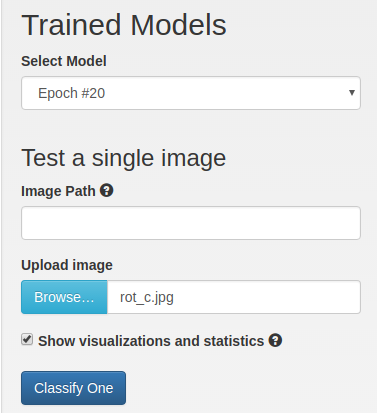

TrailNet DNN has two heads, orientation and translation, so it should be trained in two steps:
1. Full training of orientation head on orientation dataset (e.g. Forest Trails or user-collected).
2. Fine-tuning translation head on translation dataset (user-collected).

The next steps describe how to do it using NVIDIA DIGITS.

1. [Training orientation head](#training-orientation-head)
2. [Training translation head](#training-translation-head)
3. [Debugging DNN](#debugging-dnn)

# Training orientation head
To train orientation head:
1. Create a new **Image Classification Model**.
2. Select proper dataset.
3. Set all hyper-parameters values like in the paper (you can experiment with hyper-parameter tuning later).
4. Provide full path to Python layers file located at `redtail/models/nets/python-layers.py`.
5. Click on **Custom Network** tab and paste network definition from `redtail/models/nets/ResNet/srelu-resnet-18.prototxt`.
6. Click **Create** button and wait until the training is finished.

Example:

# Training translation head
The fine-tuning on translation dataset is very similar to full training with just a couple of differences:
1. Use `TrailNet_SResNet-18.prototxt`  model definition file.
2. Provide full path to pretrained orientation model in **Pretrained model(s)** field on **Custom Network** tab.

Example:

# Debugging DNN
Obtaining a good model can be a challenge sometimes. In general, if you train TrailNet with default parameters i.e. those described in the paper and provided Caffe files, you should get a network very similar to the DNN in `pretrained` directory. 
## Validation accuracy
First step is to make sure you get a similar accuracy on validation dataset. Due to entropy term in the TrailNet loss, the validation accuracy will not be very high but it should be at least 82-85%.

## Visualize DNN outputs
To understand what features DNN learns, it is useful to look into activations of various layers in the network. DIGITS provide a simple and convenient way to visualize feature maps via `Classify One` button on a model page. Make sure to check `Show visualizations and statistics` checkbox:

Here is the example of activations from one of the layers of the network:

By looking at activations, it is possible to get insight into what network learns (or does not learn) and possibly correct the training process to get a better model.

Another visualization technique is used in our [demo videos](https://www.youtube.com/watch?v=4_TmPA-qw9U&t=8) where the trail is colored in green and surrounding forest in red. Such visualization is based on [VisualBackProp](https://arxiv.org/abs/1611.05418) paper. For this visualization, we created a deconvolutional neural network which mirrors the TrailNet and back-propagated certain feature maps that represented trail and background features. That is, for every frame in the video, we did a forward pass of the TrailNet and then forward pass of the deconvolutional network which projected activations from TrailNet into original image.

 

 